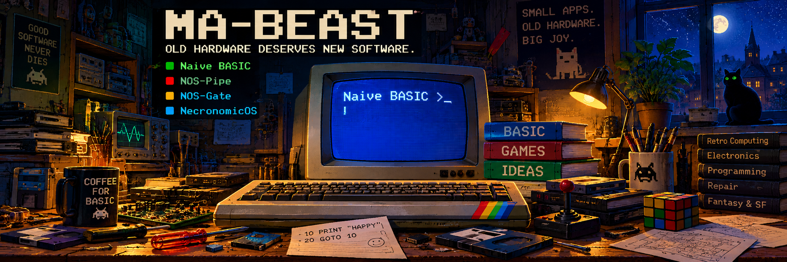

  

[English](#english) | [Русский](#russian)

# MA-BEAST

**Mikhail Zverev — engineer, programmer, occasional writer, and enthusiast for technology that is still too early to throw away.**

Born in the USSR, living in Ukraine.

Over the years I have worked in around twenty professions: medical equipment technician, electrician, programmer, laser technician, photographer, communications technician, TV repairman, printing-equipment mechanic, high-altitude cable installer, and quite a few others. Often two or three jobs at the same time.

I have practised sport and historical fencing, underwater swimming, radio direction finding, aircraft modelling and ship modelling.

These days I am mostly a homebody, husband and father.

I have been writing since March 2014.  
**For hooligan reasons. And when there is nothing left to read.**

---

## Old hardware is still too early to throw away

I am interested in small programs that return practical use to old computers, phones and operating systems.

Not emulation for emulation's sake and not museum pieces behind glass, but a simple principle:

> **If the machine still works, let's try to make it do something useful.**

### Naive BASIC

A BASIC interpreter for Android, including genuinely old devices.

The classic approach: write a program → `RUN` → get a result. No need to turn a few lines of BASIC into a modern software project.

The finished **[Naive BASIC bas2apk with NaiveWORK](https://github.com/ma-beast/Naive-BASIC-bas2apk)** turns compatible BASIC programs into standalone Android APKs.

**[Naive BASIC](https://github.com/ma-beast/Naive-BASIC)** · **[Examples-BAS](https://github.com/ma-beast/Examples-BAS)**

### NOS-Pipe

A lightweight shell for watching YouTube on old and weak computers that can no longer cope with the modern web.

The project has been tested on **Windows, macOS and Linux**. It is based on Java 5 and can in principle run on other operating systems where **Java 5 or newer** and a suitable media player are available.

Old Windows versions, weak processors and tiny screens — the things modern websites have long considered archaeology.

### NOS-Gate

A gateway between the modern Internet and old browsers.

The idea is simple: NOS-Gate receives the heavy modern page, while the old computer gets something it can still display and use normally.

### NecronomicOS

The project that gave this whole workshop its name.

A separate project page is being prepared.

---

## I also write

Science fiction, fantasy, and whatever appears when there is nothing left to read and sitting idle is not an option.

My texts are published in the Russian-language **Samizdat magazine**:  
**[Mikhail Zverev's author page](https://samlib.ru/z/zwerew_m_a/)**

---

## Workshop philosophy

**Small apps. Old hardware. Big joy.**

This is not about proving that a twenty-year-old computer is better than a modern one.

It is about finding out **what it can still do.**

`10 PRINT "IDEAS ALWAYS RUN"`  
`20 GOTO 10`

[Русский](#russian) | [↑ Top](#top)

---

# MA-BEAST — Русский

**Михаил Зверев — инженер, программист, немного писатель и любитель техники, которую ещё рано выбрасывать.**

Родился в СССР, живу в Украине.

За жизнь успел сменить около двадцати профессий: медтехник, электрик, программист, лазерщик, фотограф, связист, телемастер, механик типографского оборудования, кабельщик-высотник и ещё много чего. Работал часто на двух-трёх работах одновременно.

Занимался спортивным и историческим фехтованием, подводным плаванием, спортивной радиопеленгацией, авиа- и судомоделизмом.

Сейчас — домосед, муж и отец.

Пишу с марта 2014 года.  
**Из хулиганских побуждений. И когда почитать нечего.**

---

## Старое железо ещё рано выбрасывать

Мне интересны небольшие программы, которые возвращают практический смысл старым компьютерам, телефонам и операционным системам.

Не эмуляция ради самой эмуляции и не музей под стеклом, а принцип:

> **Если машина ещё работает — попробуем заставить её делать что-нибудь полезное.**

### Naive BASIC

BASIC-интерпретатор для Android, включая действительно старые устройства.

Классический подход: написал программу → `RUN` → получил результат. Без необходимости превращать несколько строк BASIC в современный программный проект.

Готовый **[Naive BASIC bas2apk с NaiveWORK](https://github.com/ma-beast/Naive-BASIC-bas2apk)** превращает совместимые BASIC-программы в самостоятельные Android APK.

**[Naive BASIC](https://github.com/ma-beast/Naive-BASIC)** · **[Examples-BAS](https://github.com/ma-beast/Examples-BAS)**

### NOS-Pipe

Лёгкая оболочка для просмотра YouTube на старых и слабых компьютерах, которым современный веб уже не по зубам.

Проект тестировался на **Windows, macOS и Linux**. В основе — Java 5; в принципе NOS-Pipe может работать и на других операционных системах, где доступна **Java 5 или новее** и подходящий медиаплеер.

Старые Windows, слабые процессоры, маленькие экраны — всё то, что современные сайты давно считают археологией.

### NOS-Gate

Шлюз между современным Интернетом и старыми браузерами.

Идея проста: тяжёлую современную страницу принимает NOS-Gate, а древний компьютер получает то, что ещё способен нормально показать и использовать.

### NecronomicOS

Проект, с которого всё это хозяйство получило своё имя.

Отдельная страница проекта готовится.

---

## Ещё я пишу

Фантастика, фэнтези и всё, что возникает, когда читать нечего, а спокойно сидеть без дела не получается.

Мои тексты опубликованы в **Журнале «Самиздат»**:  
**[Авторская страница Михаила Зверева](https://samlib.ru/z/zwerew_m_a/)**

---

## Философия мастерской

**Small apps. Old hardware. Big joy.**

Здесь не пытаются доказать, что компьютер двадцатилетней давности лучше современного.

Здесь проверяют, **что он всё ещё может сделать.**

`10 PRINT "IDEAS ALWAYS RUN"`  
`20 GOTO 10`

[English](#english) | [↑ Наверх](#top)
